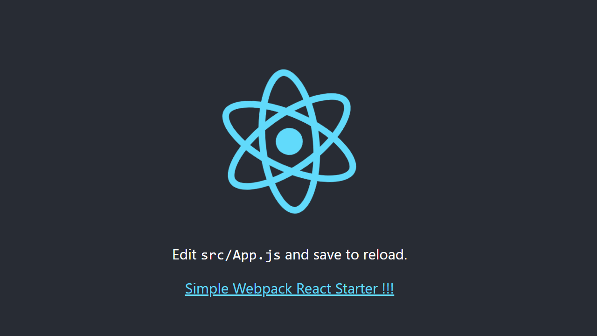

# Simple Webpack React Starter  -  [ParcelJS Version](https://github.com/daimalou/simple-parcel-react-starter)


Creat-React-App is very easy to use. I want to know how they made it. So I `npm eject` and analysis `webpack.config.js`.


I Separated two config files `webpack.dev.js` and `webpack.prod.js` from it. [Use one config file. Do This.](https://webpack.js.org/configuration/configuration-types/#exporting-a-function)


### Creat-React-App is amazing. I learn a lot from it !!!

Some plugins are not installed . It's a little hard to config. 

Such as: [react-dev-utils](https://www.npmjs.com/package/react-dev-utils) ...


# VS Code Plugin

[Prettier - Code formatter](https://marketplace.visualstudio.com/items?itemName=esbenp.prettier-vscode)

[Eslint](https://marketplace.visualstudio.com/items?itemName=dbaeumer.vscode-eslint)

# Include

[React](https://reactjs.org) 16.8.1

[React-Dom](https://reactjs.org) 16.8.1

[react-app-polyfill](https://github.com/facebook/create-react-app/tree/master/packages/react-app-polyfill) 0.2.1

[Sass](https://sass-lang.com/install) 1.17.0

### Babel 7.X and Plugins:

[@babel/core](https://babeljs.io/docs/en/babel-core)

[@babel/preset-env](https://babeljs.io/docs/en/babel-preset-env)

[@babel/preset-react](https://babeljs.io/docs/en/babel-preset-react)

[@babel/plugin-proposal-class-properties](https://babeljs.io/docs/en/babel-plugin-proposal-class-properties)

[@babel/plugin-proposal-export-default-from](https://babeljs.io/docs/en/babel-plugin-proposal-export-default-from)

[@babel/plugin-syntax-dynamic-import](https://babeljs.io/docs/en/babel-plugin-syntax-dynamic-import)

[BrowsersList](https://github.com/browserslist/browserslist)

### Eslint and Plugins:

[eslint](https://github.com/eslint/eslint)

[babel-eslint](https://github.com/babel/babel-eslint)

[eslint-plugin-flowtype](https://github.com/gajus/eslint-plugin-flowtype)

[eslint-plugin-import](https://github.com/benmosher/eslint-plugin-import)

[eslint-plugin-jsx-a11y](https://github.com/evcohen/eslint-plugin-jsx-a11y)

[eslint-plugin-react](https://github.com/yannickcr/eslint-plugin-react)

[eslint-config-react-app](https://www.npmjs.com/package/eslint-config-react-app) -Official Eslint Preset. Easy to use.

### Webpack and Loader and Plugins:

[webpack Page](https://webpack.js.org/)

webpack

webpack-cli

webpack-dev-server - Support HMR

webpack-manifest-plugin

[Loaders Page](https://webpack.js.org/loaders)

[babel-loader](https://github.com/babel/babel-loader)

eslint-loader

style-loader

css-loader

sass-loader

[url-loader](https://github.com/webpack-contrib/url-loader)

[file-loader](https://github.com/webpack-contrib/file-loader) - Load SVG

[@svgr/webpack](https://www.npmjs.com/package/@svgr/webpack) -Load SVG

postcss-loader

postcss-flexbugs-fixes

postcss-preset-env

postcss-safe-parser

[Plugins Page](https://webpack.js.org/plugins)

terser-webpack-plugin

clean-webpack-plugin - Auto clean build folder.

html-webpack-plugin

[mini-css-extract-plugin](https://github.com/webpack-contrib/mini-css-extract-plugin) - Extract Css file

[optimize-css-assets-webpack-plugin](https://www.npmjs.com/package/optimize-css-assets-webpack-plugin)

case-sensitive-paths-webpack-plugin


# Not Include

[Jest](https://github.com/facebook/jest)


## Download

```
git clone https://github.com/daimalou/simple-webpack-react-starter
cd simple-webpack-react-starter
yarn or npm i
```

## Dev && Build

```
yarn start && yarn build
npm run start && npm run build
```

## ScreenShot


## Resources

[Webpack Documentation](https://webpack.js.org/concepts)

[Babel Plugins](https://babeljs.io/docs/en/plugins)

[Configuring ESLint](https://eslint.org/docs/user-guide/configuring#specifying-parser-options)

[babel-preset-react-app](https://www.npmjs.com/package/babel-preset-react-app) -Official Babel Preset - [Issues#2377](https://github.com/facebook/create-react-app/issues/2377)

[splitChunks not working as expected](https://github.com/webpack/webpack/issues/6916)

[Webpack 4 splitChunks causes reused chunks to not be executed](https://github.com/webpack/webpack/issues/7230)

[]()

## License

MIT
